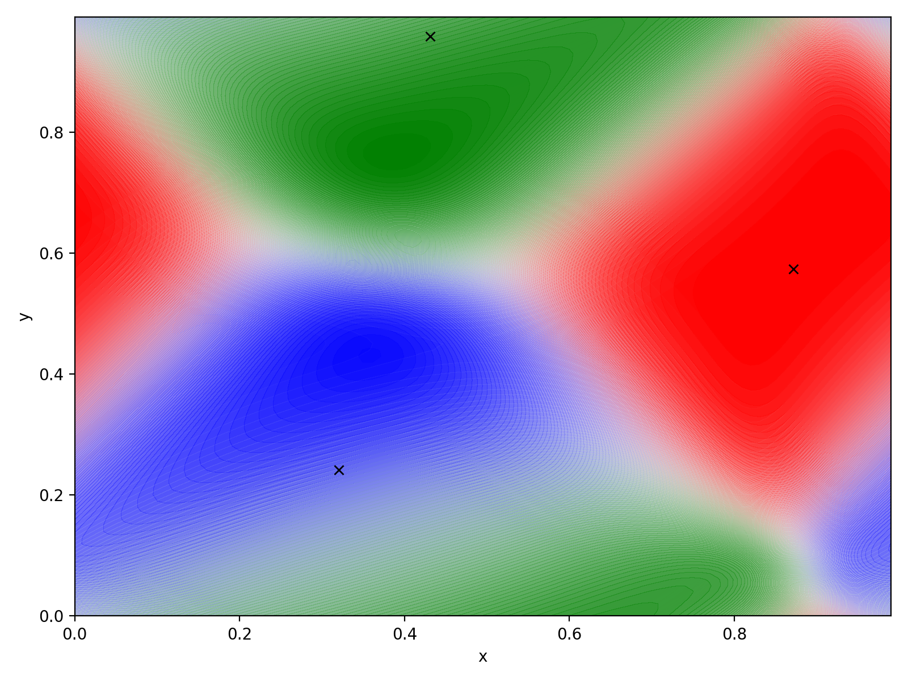

# meshlessHydro
Implementing a meshless scheme for hydrodynamic particle simulations as described implemented in [GIZMO](http://www.tapir.caltech.edu/~phopkins/Site/GIZMO.html).

## Resources

- [Paper describing the algorithm](https://arxiv.org/abs/1409.7395)

## Project structure

### File tree
```
├── LICENSE
├── README.md
├── demonstrator 
│   ├── Makefile
│   ├── include
│   │   ├── ConfigParser.h
│   │   ├── H5Profiler.h
│   │   ├── InitialDistribution.h
│   │   ├── Logger.h
│   │   ├── Particles.h
│   │   └── global.h
│   └── src
│       ├── ConfigParser.cpp
│       ├── H5Profiler.cpp
│       ├── InitialDistribution.cpp
│       ├── Particles.cpp
│       └── main.cpp
├── media 
│   └── volumePartition.png
├── snippets
│   └── volumePartition
│       └── volumePartition.py
└── testcases
    ├── kelvin-helmholtz
    │   └── generateIC.py
    └── sedov
        └── initial_sedov.py
```
### Directories

- `demonstrator` is dedicated to write a single CPU C++ program to implement the algorithm
- `media` holds resources for readme files
- `snippets` is for miscellaneous scripts to fool around 
- `testcases` includes subdirectories with standard test cases to validate the code


## Visualization

### Volume partition
The volume partition for a random particle distribution and periodic boundary conditions is shown below:

The plot can be generated in `snippets/volumePartition`.

## Test problems

### Kelvin-Helmholtz instability

A 2D test case setup as described in [McNally et. al. (2012)](https://arxiv.org/abs/1111.1764). 

<!--

### Sedov blast wave


### Keplerian disk
-->